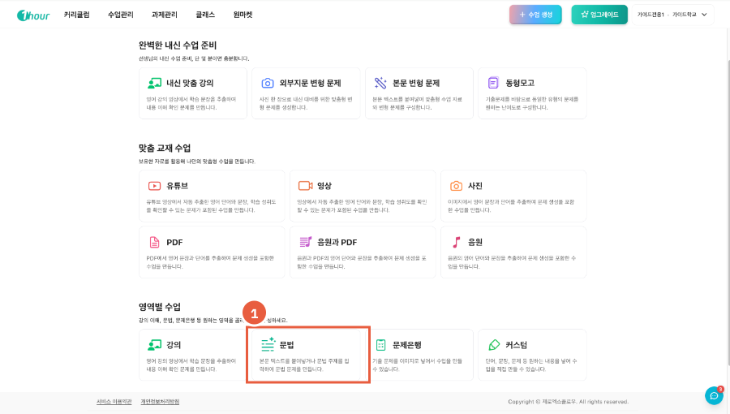
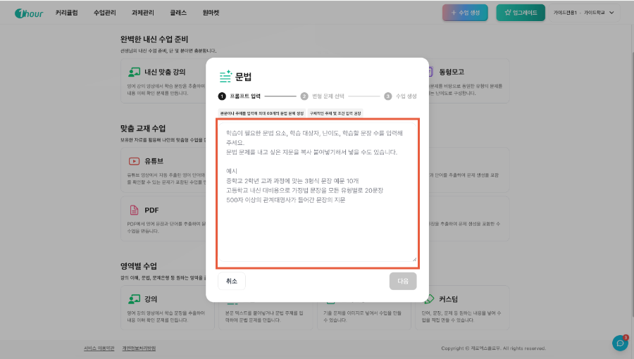
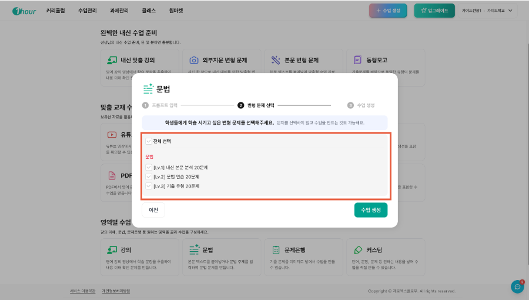

# 원아워로 문법 문제, 3800제 같은 문제 만들 수 있나요?

학습하고 싶은 문법학습의 유형이나 지문을 입력하면 원아워가 문제를 포함한 온라인 수업을 자동으로 만들어 드립니다.

### 이런 경우에 편리합니다

* 교과 과정에 맞는 예문이나 문제가 필요할 때
* 특정 지문을 기반으로 문법 포인트를 뽑아 수업을 만들고 싶을 때
* 난이도나 문장 수를 달리한 반복 학습 수업을 구성할 때

### 이용 방법

## 1. 수업 생성 화면 진입하기



원아워 **선생님 계정**으로 로그인합니다.



화면 오른쪽 상단의 **\[수업생성]** 버튼을 클릭합니다.

<figure><figcaption></figcaption></figure>



## 2. \[문법] 카드 선택하기



수업 유형 선택 화면에서 **\[문법]** 카드를 클릭합니다.



입력창에 **학습이 필요한 문법 요소, 학습 대상자, 난이도, 학습할 문장 수**를 포함해 원하는 조건을 입력하거나 학습에 활용할 **지문을 복사해 붙여넣습니다.**&#x20;

입력 예시:&#x20;

* `중학교 2학년 교과 과정에 맞는 3형식 문장 예문 10개`
* `고등학교 내신 대비용으로 가정법 문장을 모든 유형별로 20문장`



입력이 완료되면 **\[다음]** 버튼을 클릭합니다. 

<figure><figcaption></figcaption></figure>




**💡 조건이 구체적일수록 결과가 정확합니다**

학년, 교과 과정, 문법 요소, 문장 수를 모두 포함해 입력하면 의도에 맞는 수업이 생성됩니다. 조건이 모호할 경우 원하는 결과와 다를 수 있습니다.


## 3. 문제 유형 선택하기



제공되는 **3가지 문제 유형** 중 원하는 유형을 선택합니다.

전체 선택 또는 중복 선택이 모두 가능합니다. 필요에 따라 복수 선택하세요.



선택이 완료되면 **\[수업생성]** 버튼을 클릭합니다.

<figure><figcaption></figcaption></figure>




## 4. 생성된 수업 확인하기



생성된 수업의 문제 구성과 내용을 검토하고 학습에서 활용하세요!

생성 된 문제 예시를 아래 이미지로 살펴보세요.&#x20;

1\)과제내기 또는 2)학습지 만들기를 눌러 온오프란인 과제로 출제할 수 있습니다.&#x20;

<figure><figcaption>
(문제 생성 예시)
</figcaption></figure>


