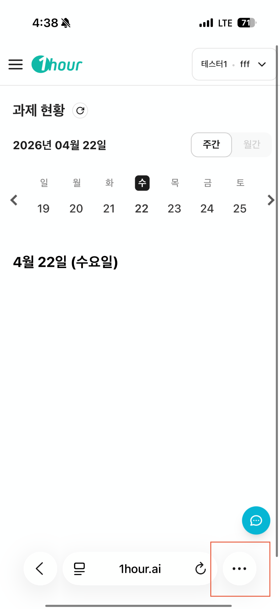
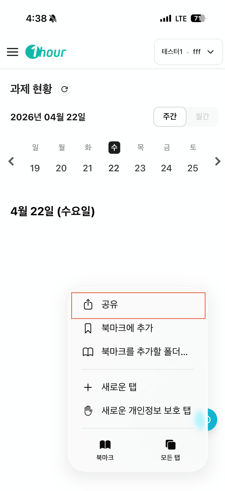
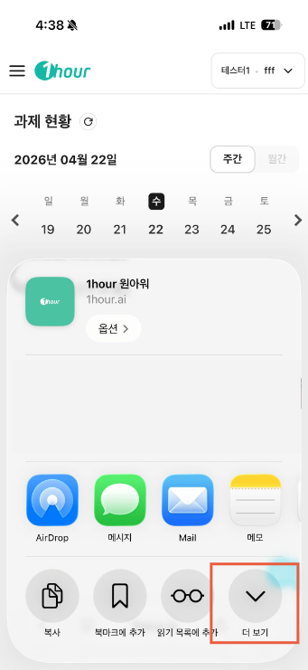
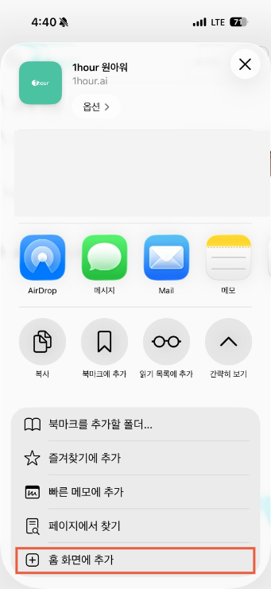
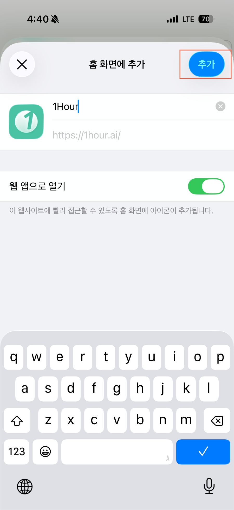
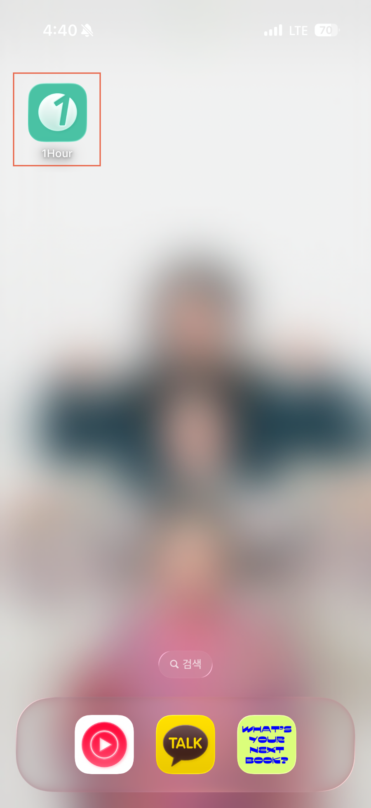

# 홈 화면에 원아워 바로가기 만들기 (Safari)

매번 Safari에서 원아워를 검색하는 번거로움 없이, 홈 화면 아이콘 하나로 바로 접속하세요.



### 1. Safari에서 원아워 실행 후 더보기 선택

1. iPhone에서 **Safari** 앱을 실행하고 원아워 사이트로 이동하세요.
2. Safari 하단 툴바에서 **더 보기(⋯) 버튼**을 탭하세요.

<figure><figcaption></figcaption></figure>



### 공유 메뉴 열기

1. 메뉴가 열리면 **'공유'** 를 탭하세요.


**버튼이 보이지 않나요?**

화면을 위로 살짝 스크롤하면 하단 툴바가 나타납니다. 또는 화면 하단 중앙의 네모+화살표(↑) 모양 공유 아이콘을 바로 탭해도 됩니다.


<figure><figcaption></figcaption></figure>



### '홈 화면에 추가' 선택하기

1. 공유 시트 하단 옵션 목록을 **아래로 스크롤**하세요.
2. **'홈 화면에 추가'** 항목을 탭하세요.

<figure><figcaption></figcaption></figure> <figure><figcaption></figcaption></figure>




### 바로가기 이름 확인 후 추가

1. 바로가기 이름 입력란에 원하는 이름(예: **원아워**)이 표시되는지 확인하세요.
2. 필요하면 이름을 수정한 뒤 오른쪽 상단 **'추가'** 버튼을 탭하세요.

<figure><figcaption></figcaption></figure>



### 홈 화면에서 바로가기 확인

1. 홈 화면으로 이동하여 원아워 바로가기 아이콘이 추가되었는지 확인하세요.
2. 아이콘을 탭해 원아워가 정상적으로 열리는지 테스트하세요.


**아이콘이 보이지 않으면?**

홈 화면을 좌우로 넘겨 다른 페이지에 추가되지 않았는지 확인하세요.&#x20;


<figure><figcaption></figcaption></figure>


