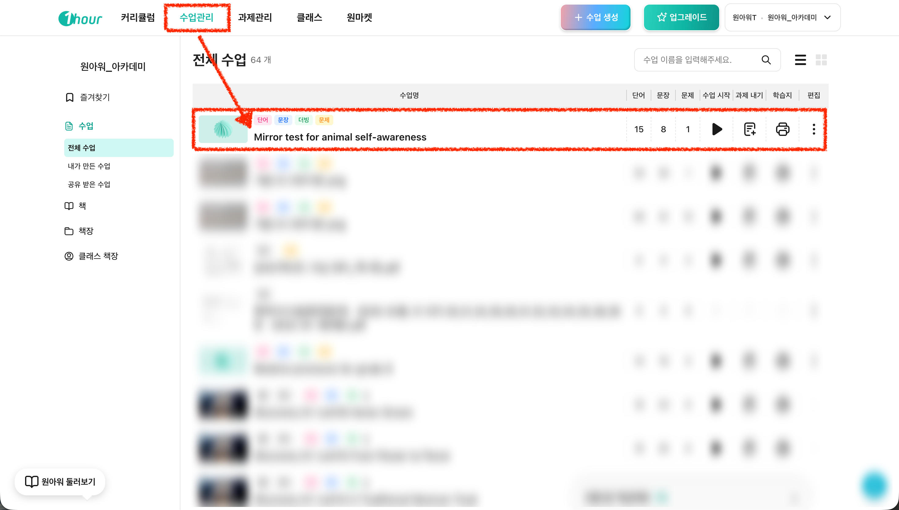

# 2. 본문 텍스트 입력  → 변형문제 생성

#### I. 이런 분들에게 추천해요

* 본문 텍스트를 복사/붙여넣기 할 수 있는 분
* 시험 범위 본문이나 부교재 지문이 이미 정리되어 있는 분
* 텍스트 기반 자료를 "내용 이해, 단어, 문법" 등 다양한 형태 변형문제로 만들고 싶은 분

#### II. **영상 보며 따라하기**

#### III. 이미지 보며 따라하기

1. **우상단 "+ 수업 생성" 버튼 클릭 후 "본문 변형 문제" 선택해 주세요.**

<figure><figcaption></figcaption></figure>

2. **붙여넣을 본문을 작성 후 다음을 클릭해 주세요.**

<figure><figcaption></figcaption></figure>

3. **원하는 변형 문제 유형을 선택해 주세요.**
   * 내신 대비의 경우, \[파이널] 유형을 추천드려요.
   * 동화책 혹은 리딩서의 경우, \[내용 이해], \[문법], \[단어] 유형을 추천드려요.

<figure><figcaption></figcaption></figure>

4. **"작업목록" 진행 중 상태가 완료되면 문제 생성이 끝나요.**
   * 굳이 '문제 생성 시간'을 기다리지 않아도 됩니다. 동시에 다른 문제를 바로 생성하실 수 있어요!

<figure><figcaption></figcaption></figure>

5.  **문제 생성이 완료되었다면 "수업관리"에서 확인하실 수 있어요.**

    *   이후 아래 2가지 용도에 따라 활용하실 수 있습니다.

        * \[과제 내기] 온라인 학습용, 학생에게 과제 부여 [\*자세한 가이드는 해당 페이지를 확인해 주세요!](https://1hour.gitbook.io/guide/teacher/assignment-management)
        * \[학습지 만들기] 오프라인 수업용, 프린트 학습지를 만드는 용도

    <figure><figcaption></figcaption></figure>
