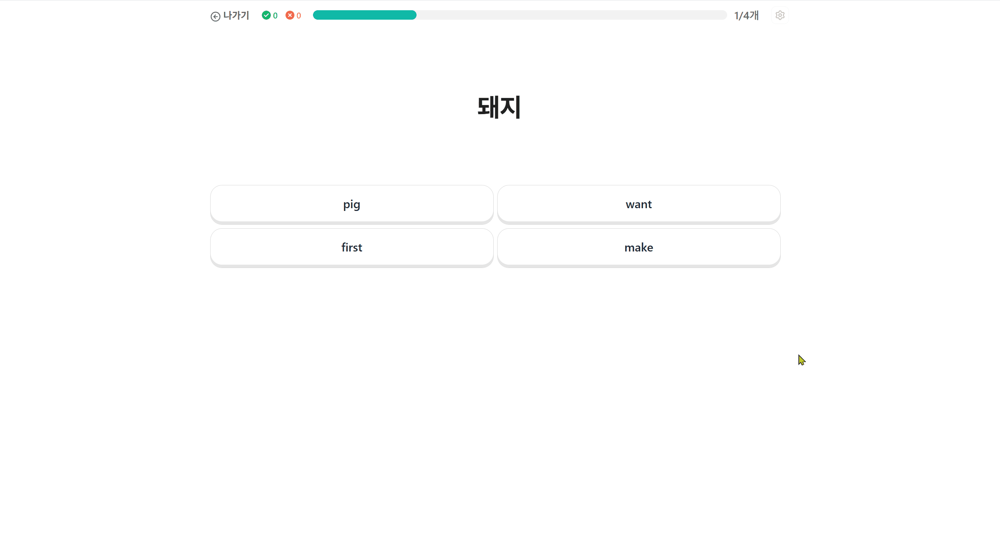
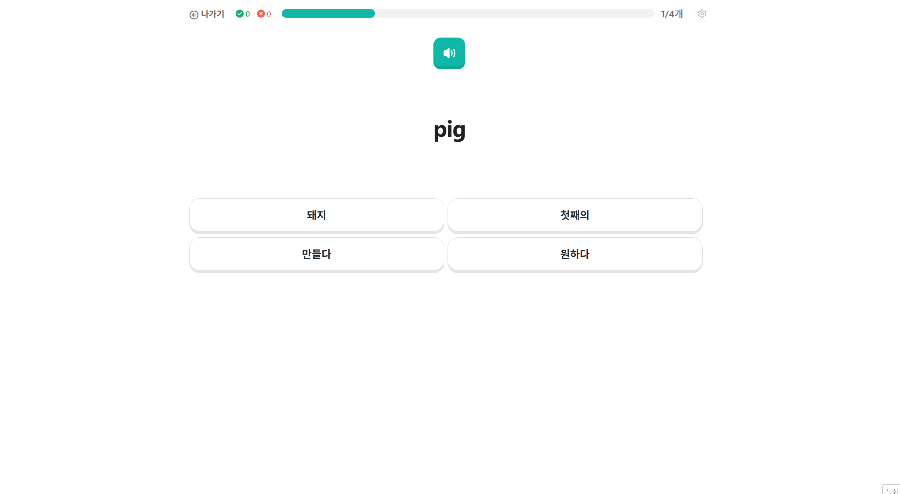
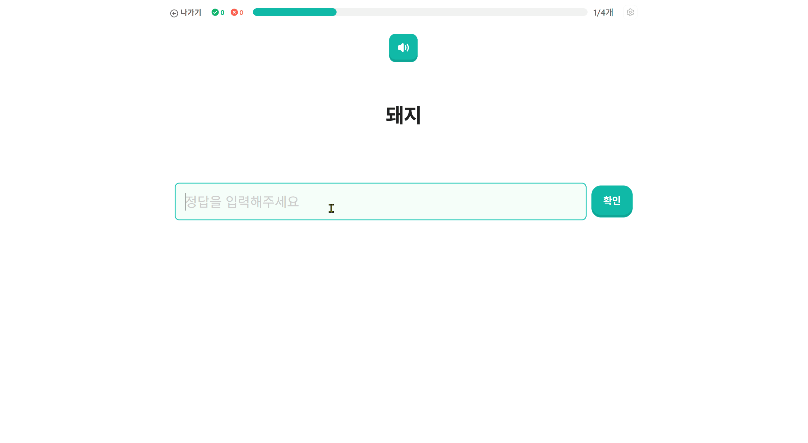
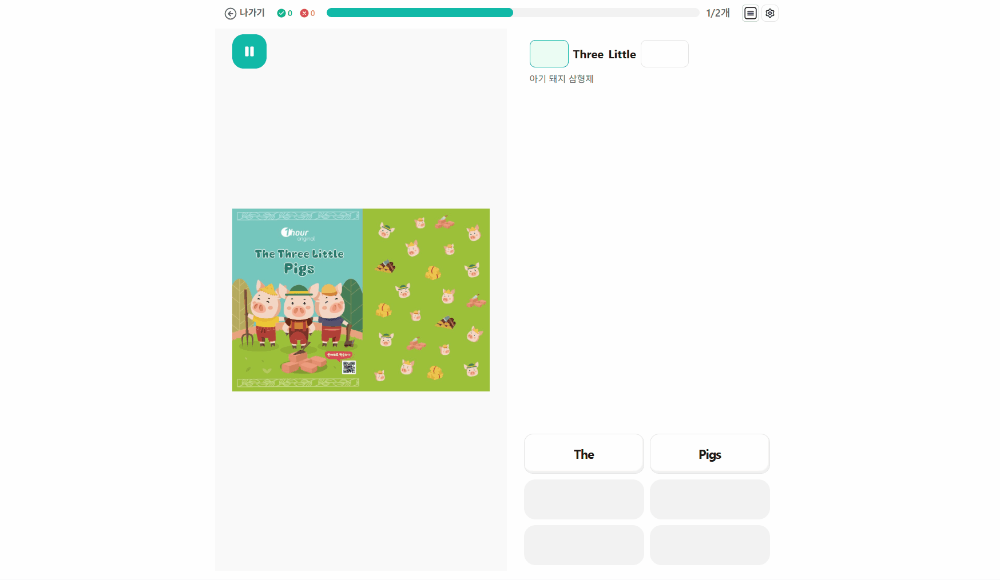
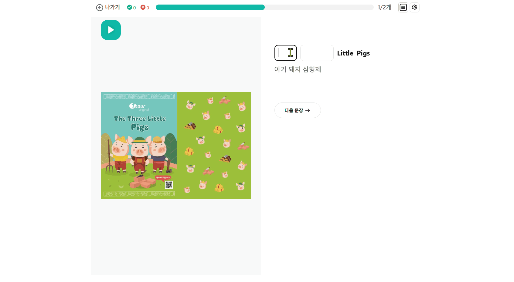
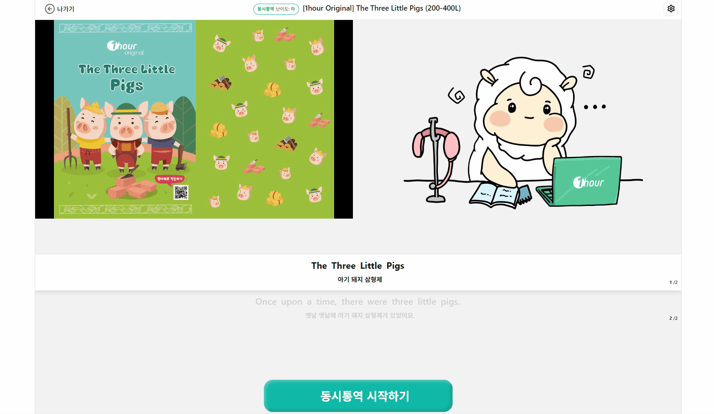
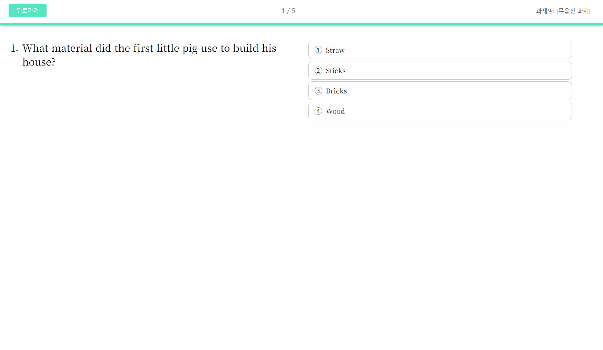
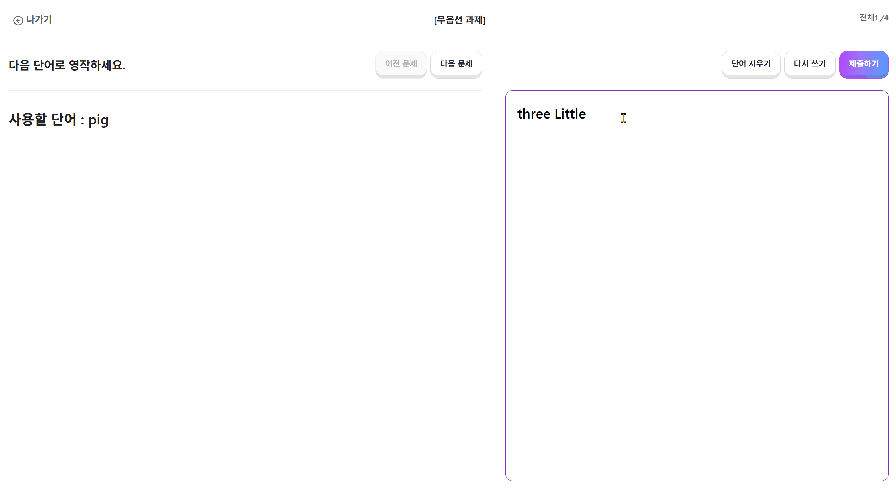

# 과제유형 알아보기

과제 유형별 풀이 방법을 안내합니다.

***

## 단어 과제

### 단어 고르기

뜻을 보고 알맞은 단어를 보기에서 선택하세요.

<figure><figcaption></figcaption></figure>

***

### 해석 고르기

단어를 보고 알맞은 뜻을 보기에서 선택하세요.

<figure><figcaption></figcaption></figure>

***

### 단어 써보기

뜻을 보고 단어를 직접 입력하세요. 입력 후 확인 버튼을 눌러 정답을 확인할 수 있습니다.

<figure><figcaption></figcaption></figure>

***

## 문장 과제

### 어순배열

흩어진 단어들을 올바른 순서로 배열하여 문장을 완성하세요. 단어를 클릭하면 순서대로 문장이 만들어집니다.

<figure><figcaption></figcaption></figure>

***

### 빈칸 써보기

문장의 빈칸에 알맞은 단어를 직접 입력하세요.

<figure><figcaption></figcaption></figure>

***

### 문법 고르기

문법적으로 올바른 표현을 보기에서 선택하세요.

<figure><figcaption></figcaption></figure>

***

## 말하기 과제

### 더빙

영상 또는 음원을 듣고 따라 녹음하세요. **발음 분석을 받을 수 있어요.**



\[시작] 버튼을 눌러 원본 음원을 들어보세요.


마이크 권한을 허용해야 녹음할 수 있어요.




\[더빙 시작하기] 버튼을 누르고 따라 말하세요.



녹음이 끝나면 \[더빙 종료하기] 버튼을 누르세요.



다시 녹음하고 싶다면 \[다시 녹음] 버튼을 누르세요.



<figure><figcaption></figcaption></figure>

***

### 동시통역

음원을 들으면서 동시에 통역하여 녹음하세요.



\[시작] 버튼을 누르면 음원 재생과 녹음이 동시에 시작됩니다.

소리를 들으면서 동시에 말해 말하세요.



음원이 끝나면 \[동시통역 종료하기] 버튼을 누르세요.



다시 녹음하고 싶다면 \[다시 녹음] 버튼을 누르세요.



<figure><figcaption></figcaption></figure>

***

## 문제 과제

### 문제

문제를 풀어보세요.

<figure><figcaption></figcaption></figure>

***

## 영작 과제

### 단어 영작

주어진 단어를 활용하여 문장을 작성하세요.

<figure><figcaption></figcaption></figure>

***

### 문장 영작 (서술형)

주어진 조건에 맞게 영어 문장을 작성하세요.

<figure><figcaption></figcaption></figure>

***

### 문장 영작 (해석)

한글 해석을 보고 영어 문장으로 작성하세요.

<figure><figcaption></figcaption></figure>

***

### 에세이 영작

주어진 주제에 맞게 글을 작성하세요. 타이핑이 어렵다면 손글씨로 작성한 에세이 이미지도 추가할 수 있어요.

<figure><figcaption></figcaption></figure>

***
