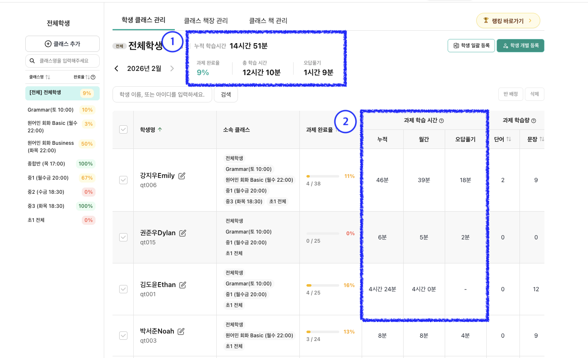

# 학생 데이터

## 과제 학습 시간이란?

클래스 페이지에서 학생별 과제 학습 시간을 확인할 수 있습니다. \
학생이 학습한 시간을 누적·월간·오답풀기 시간으로 나누어 보여줍니다.

**이럴 때 사용하세요** &#x20;

* 이번 달 특정 학생이 실제로 얼마나 공부했는지 확인하고 싶을 때&#x20;
* 학부모 상담 시 학습 시간 데이터를 리포트에 포함하고 싶을 때&#x20;
* 클래스 전체 학생의 학습량을 한눈에 비교하고 싶을 때

**접속 방법** 클래스 > 학생 클래스 관리

**화면 구성**

<figure><figcaption></figcaption></figure>

1. 상단에는 클래스 전체 학생의 합산 학습 시간이 표시됩니다.

<table><thead><tr><th width="178.76171875">항목</th><th>설명</th></tr></thead><tbody><tr><td>누적 학습</td><td>클래스에 속한 전체 학생의 누적 학습 시간 총합 (오답풀기 포함)</td></tr><tr><td>클래스 학습 시간</td><td>클래스에 속한 전체 학생의 월간 학습 시간 총합 (오답풀기 포함)</td></tr><tr><td>오답풀기</td><td>클래스에 속한 전체 학생의 오답풀기 시간 총합</td></tr></tbody></table>

2. 학생 목록에서는 선택한 월의 학생별 누적 / 월간 / 오답풀기 시간이 표시됩니다.&#x20;

<table><thead><tr><th width="173.0625">항목</th><th>설명</th></tr></thead><tbody><tr><td>누적</td><td>오늘까지 수행한 전체 과제 학습 시간의 합 (오답풀기 포함)</td></tr><tr><td>월간</td><td>선택한 월 1일부터 오늘까지 수행한 과제 학습 시간의 합 (오답풀기 포함)</td></tr><tr><td>오답풀기</td><td>선택한 월 1일부터 오늘까지 수행한 오답풀기 학습 시간의 합</td></tr></tbody></table>


학습 시간은 분 단위로 표시되며, 초 단위는 버림 처리됩니다. 삭제된 과제의 학습 시간도 합산에 포함됩니다.&#x20;



전체학생(학원명)을 선택하면 특정 클래스가 아닌 학생에게 부여된 모든 과제의 학습 시간이 표시됩니다.&#x20;


## 과제 완료율이란?

과제 완료율은 학생에게 부여된 전체 과제 중 오답 풀기까지 완료한 과제의 비율입니다.&#x20;

매월 1일부터 오늘까지 부여된 과제를 기준으로 계산되며, 클래스 페이지와 대시보드에서 한눈에 확인할 수 있습니다.

#### 클래스별 과제 완료율



#### 학생별 과제 완료율



***

## 이럴 때 사용하세요

* 이번 달 우리 반 학생들이 과제를 얼마나 완료했는지 빠르게 확인하고 싶을 때
* 과제를 거의 하지 않는 학생을 찾아 개별 관리가 필요할 때
* 특정 과제에 대해 몇 명이 완료했는지 확인하고 싶을 때

***

## 진입 방법

**클래스 페이지에서 확인하기**

> \[클래스] > 학생 목록

**대시보드에서 확인하기**

> \[대시보드] > 부여한 과제 현황&#x20;

***

## 완료율 보는 방법



### 학생별 과제 완료율 확인하기

클래스 페이지 또는 대시보드 좌측 학생 목록에서 각 학생 이름 옆에 과제 완료율이 표시됩니다.

* 해당 월 1일부터 오늘까지 부여된 과제 중 완료된 비율이 숫자(%)로 나타납니다.
* 학생 이름 하단에 학생 아이디도 함께 표시됩니다.


같은 학생이라도 클래스별로 완료율이 다를 수 있습니다.&#x20;

클래스를 선택하면 해당 클래스에 부여된 과제만 기준으로 계산되고,&#x20;

기본반(전체 학생)을 선택하면 해당 학생에게 부여된 모든 과제 기준으로 계산됩니다.




### 클래스 전체 과제 완료율 확인하기

클래스 페이지 상단에서 클래스에 포함된 모든 학생의 과제 완료율을 확인할 수 있습니다.&#x20;

클래스 내 전체 과제 수 대비 완료된 과제 수를 기준으로 계산됩니다.



### 과제별 완료율 확인하기

대시보드에서 개별 과제에 대한 완료율을 확인할 수 있습니다.

* 전체 학생 선택 시: 해당 과제를 받은 학생 수 중 완료한 학생 수가 표시됩니다.
* 학생 선택 시: 해당 학생이 과제 내 학습활동을 얼마나 완료했는지 표시됩니다.



### 월별 데이터 확인하기

월 이동 버튼을 눌러 과거 월의 완료율 데이터를 확인할 수 있습니다.&#x20;

클래스 페이지에서는 최대 과거 6개월까지 조회할 수 있습니다.


당일을 기준으로 미래의 데이터는 볼 수 없습니다.&#x20;




***

## 화면 구성

### 완료율 색상 표시

완료율은 신호등 색상으로 표시되어 학생의 과제 진행 상태를 직관적으로 파악할 수 있습니다.

| 색상    | 의미                       |
| ----- | ------------------------ |
| 🔴 빨강 | 완료율 0% (과제를 하나도 완료하지 않음) |
| 🟡 노랑 | 0% 초과 \~ 100% 미만 (진행 중)  |
| 🟢 초록 | 100% (모든 과제 완료)          |

### 정렬 기능

학생 목록은 기본적으로 이름 가나다순으로 정렬됩니다. 정렬 버튼을 클릭하면 아래와 같이 정렬할 수 있습니다.

| 정렬 기준  | 첫 번째 클릭      | 두 번째 클릭      |
| ------ | ------------ | ------------ |
| 학생명    | 오름차순 (ㄱ→ㅎ)   | 내림차순 (ㅎ→ㄱ)   |
| 과제 완료율 | 오름차순 (0→100) | 내림차순 (100→0) |


완료율이 같은 학생끼리는 이름 가나다순으로 정렬됩니다.&#x20;

페이지를 새로고침하면 기본 정렬(이름 가나다순)으로 돌아갑니다.


***

## 주의사항


과제 완료율은 과제가 부여되어 있는 날짜를 기준으로 계산됩니다.&#x20;



시험모드 과제는 1차 제출 시 완료로 처리됩니다.



완료율 수치는 아래 규칙에 따라 표시됩니다.

* 과제를 하나라도 완료했는데 비율이 1% 미만이면, 0%가 아닌 1%로 올려서 표시됩니다.
* 미완료 과제가 남아 있는데 비율이 99% 이상이면, 100%가 아닌 99%로 내려서 표시됩니다.
* 그 외 구간은 소수점 첫째자리에서 반올림하여 표시됩니다.


***

## 자주 묻는 질문

Q. 같은 학생인데 클래스마다 완료율이 다르게 나와요.

A. 클래스를 선택해서 보면 해당 클래스에 부여된 과제만 기준으로 계산됩니다. 기본반(전체 학생)을 선택하면 해당 학생에게 부여된 모든 과제 기준으로 계산되므로, 클래스마다 수치가 다를 수 있습니다.

Q. 지난달 완료율이 바뀌었어요.

A. 과제 종료일 기준으로 계산되기 때문에, 지난달에 부여된 과제를 이번 달에 완료하면 지난달 수치가 변동될 수 있습니다.

Q. 다음 달 완료율은 볼 수 없나요?

A. 미래의 과제는 아직 부여되지 않았으므로 계산 및 조회가 되지 않습니다. 해당 월이 되면 확인하실 수 있습니다.

