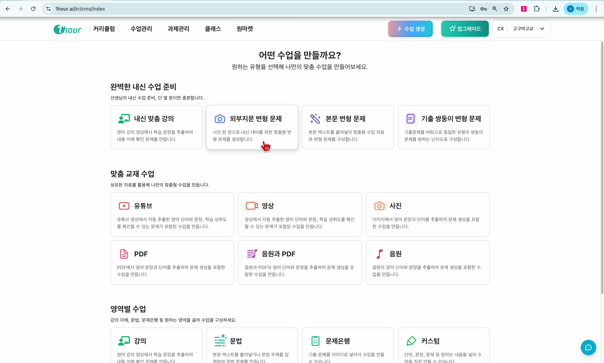
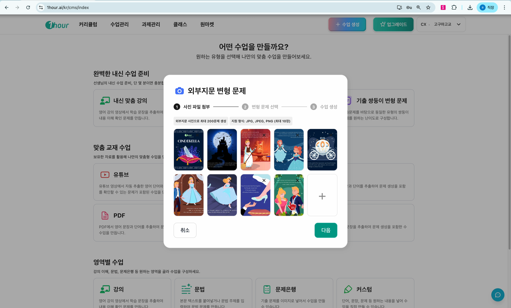
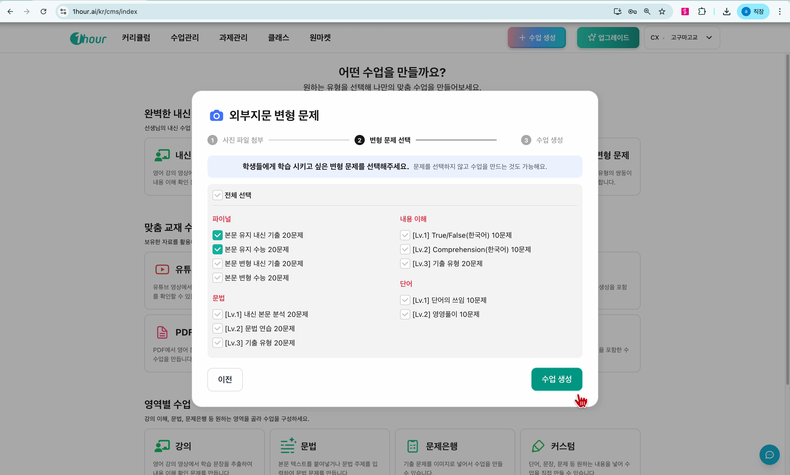
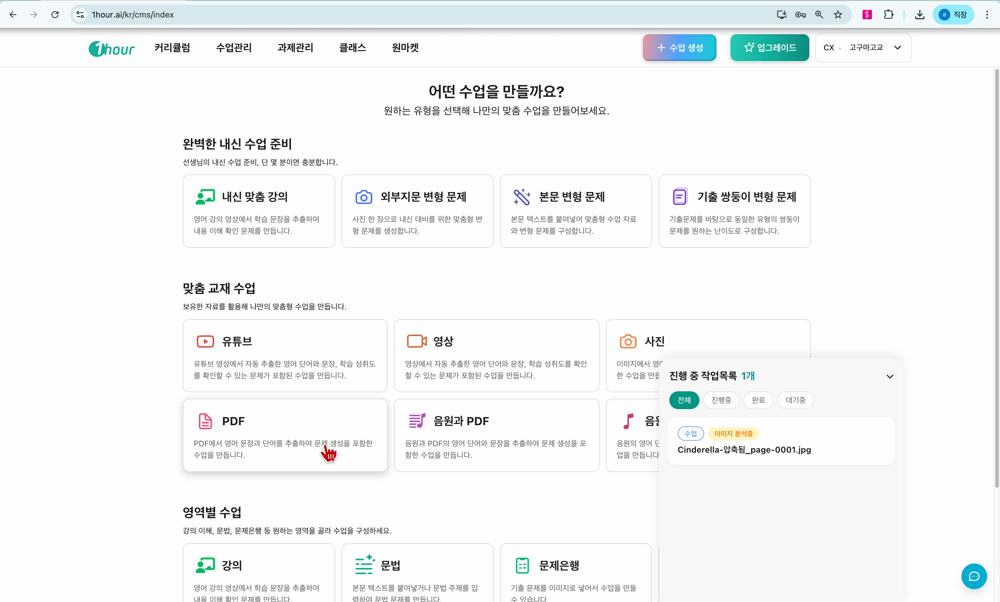
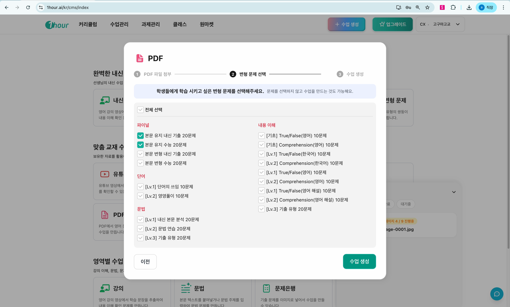
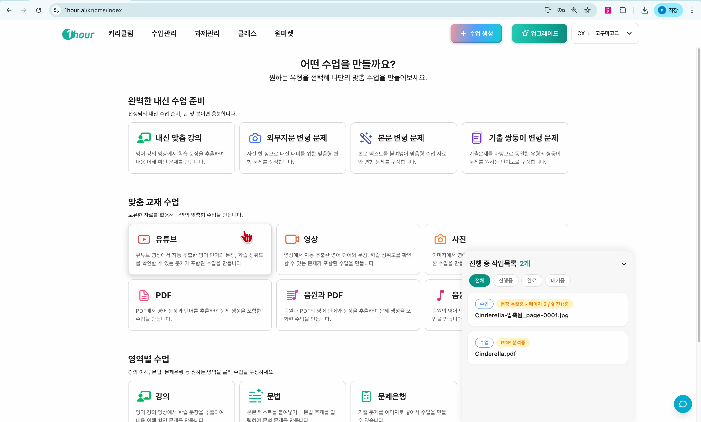
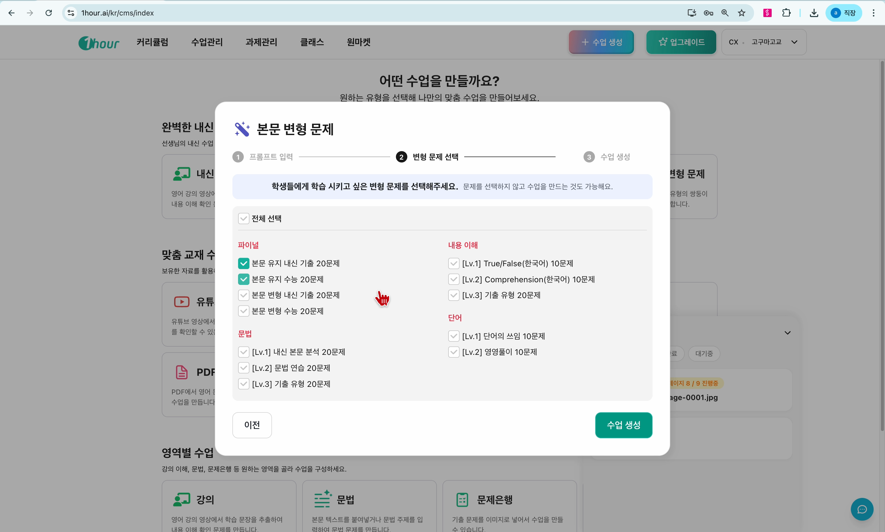

# 본문교재 수업생성

원마켓에 없는 교재라도 본문(지문)만 있으면 원아워에서 변형문제 수업을 만들 수 있습니다.&#x20;

이미지, PDF, 텍스트 중 가지고 계신 형태에 따라 아래 방법 중 하나를 선택하세요.

#### 영상을 보며 따라하기



## 방법 1. 이미지로 수업 만들기

사진이나 스캔 이미지로 지문을 가지고 계신 경우



#### 수업 생성 화면에서 **외부 지문변형문제** 카드를 선택합니다.

<figure><figcaption></figcaption></figure>




#### **이미지 선택** 버튼을 눌러 지문 이미지를 업로드합니다.

* 최대 **10장**까지 추가 가능 (긴 본문도 OK)

<figure><figcaption></figcaption></figure>




#### 원하는 **문제 유형**을 선택합니다.

<figure><figcaption></figcaption></figure>




#### **수업 생성**을 누르면 완료!



## 방법 2. PDF로 수업 만들기

PDF 파일로 교재를 가지고 계신 경우



#### 수업 생성 화면 하단의 **PDF** 버튼을 선택합니다.

<figure><figcaption></figcaption></figure>




#### PDF 파일을 선택하여 업로드합니다.

* 최대 **30mb,30장**까지 업로드 가능

<figure><figcaption></figcaption></figure>




#### 원하는 **문제 유형**을 선택합니다.

<figure><figcaption></figcaption></figure>



#### **수업 생성**을 누르면 완료!



## 방법 3. 텍스트로 수업 만들기

본문 텍스트만 가지고 계신 경우



#### 수업 생성 화면에서 **본문 변형문제** 카드를 선택합니다.

<figure><figcaption></figcaption></figure>




#### 입력창에 지문 텍스트를 **복사/붙여넣기** 합니다.

<figure><figcaption></figcaption></figure>



#### 원하는 **문제 유형**을 선택합니다.

<figure><figcaption></figcaption></figure>



#### **수업 생성**을 누르면 완료!




#### 알아두면 좋은 팁

**통합 PDF 교재를 사용하는 경우**

여러 유닛이 하나의 PDF에 들어있는 교재는 한 번에 업로드하면 **지문이 섞일 수 있습니다**.

**해결 방법:**

* PDF를 유닛별로 나눠서 업로드하거나
* 지문 부분만 이미지로 캡처하여 **방법 1**로 생성


## 자주 묻는 질문

Q. 수업 생성 중에 다른 수업도 만들 수 있나요?

네! 생성이 진행되는 동안 기다리지 않고 바로 다음 수업을 만들 수 있습니다.

Q. 이미지/PDF 최대 업로드 개수는?

* 이미지: 최대 10장
* PDF: 최대 30장

궁금한 점이 있으시면 고객센터로 문의해 주세요.
