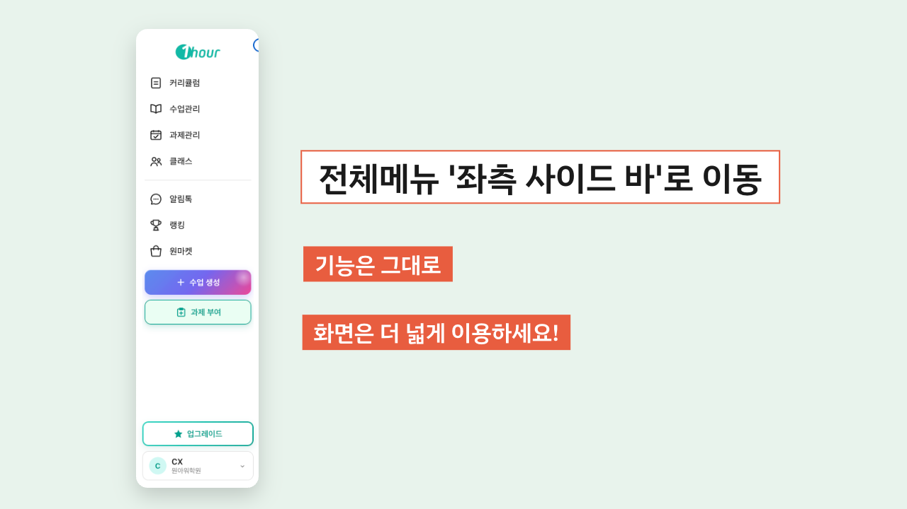
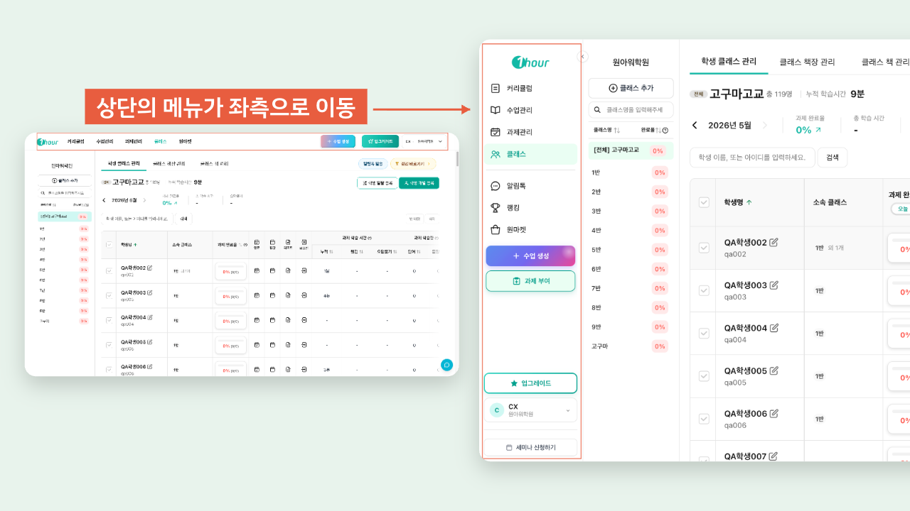
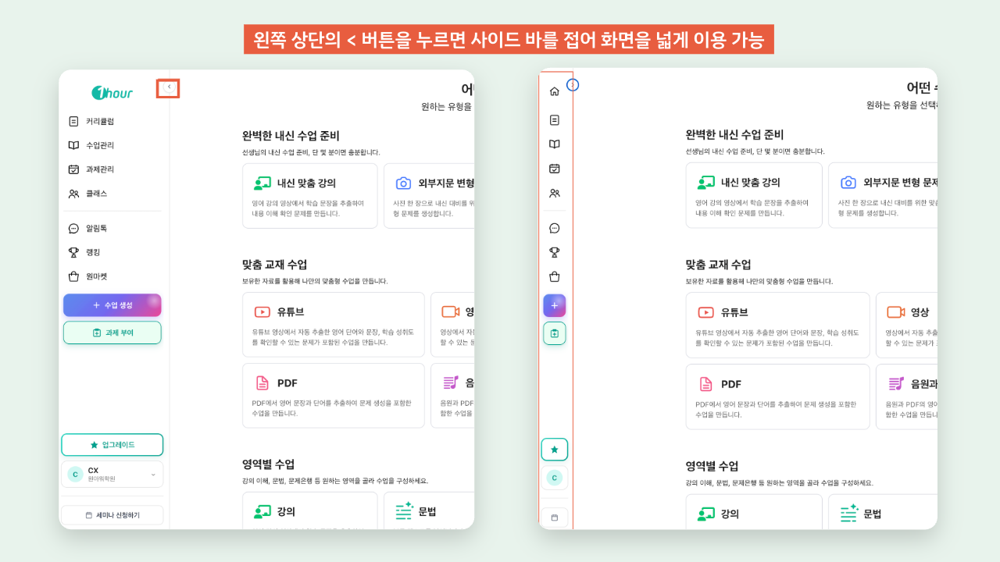

# 좌측 사이드바로 메뉴가 이동했어요

안녕하세요, 원아워입니다.

원아워의 메뉴 위치가 화면 상단에서 좌측 사이드바로 이동했습니다. 사용하시던 메뉴와 기능은 그대로이며, 위치만 옮겨졌으니 안심하고 사용해 주세요.

이번 변경으로 화면을 더 넓게 쓰실 수 있고, 과제 부여도 더 빠르게 하실 수 있습니다.

***

## 바뀐 점 한눈에 보기

<figure><figcaption></figcaption></figure>

<table><thead><tr><th width="168.62109375">구분</th><th>변경 내용</th></tr></thead><tbody><tr><td>위치 이동</td><td>화면 상단에 있던 메뉴가 좌측 사이드바로 이동</td></tr><tr><td>추가</td><td>사이드바에 <strong>"과제 부여"</strong> 버튼이 상시 노출되어 바로 과제 부여 가능</td></tr><tr><td>정리</td><td>과제관리 페이지의 <strong>"클래스 대시보드 바로가기"</strong> 메뉴가 제거</td></tr></tbody></table>

***

## 새 사이드바, 이렇게 사용하세요



### 메뉴 찾기

화면 상단에 있던 메뉴가 좌측 사이드바로 옮겨졌습니다. 메뉴 이름과 기능은 동일합니다.

* **커리큘럼 / 수업관리 / 과제관리 / 클래스 / 랭킹 / 원마켓** 메뉴를 좌측에서 그대로 이용하실 수 있습니다.
* **알림톡** 메뉴가 사이드바에 추가되었습니다. 자세한 사용법은 👉 [알림톡 가이드](https://1hour.gitbook.io/guide/teacher/undefined-5/kakaonoti)를 참고해 주세요.
* **업그레이드(요금제 안내)** 와 **마이페이지(이름·기관명) 버튼**도 좌측 사이드바 하단에서 이용하실 수 있습니다.

<figure><figcaption></figcaption></figure>




### 화면 넓게 쓰기

사이드바를 접으면 본문 영역을 더 넓게 사용하실 수 있습니다.

* 사이드바 우측 가장자리의 **토글 버튼**(◀)을 클릭하면 사이드바가 접힙니다.
* 접힌 상태에서는 아이콘만 표시되며, 아이콘에 마우스를 올리면 메뉴 이름이 나타납니다.
* 접힘 상태는 자동으로 저장됩니다. 페이지를 이동하거나 새로고침해도 마지막 상태가 그대로 유지됩니다.

<figure><figcaption></figcaption></figure>




### 과제, 더 빠르게 부여하기

사이드바에 **"과제 부여"** 버튼이 상시 노출됩니다.&#x20;

어떤 페이지에서든 버튼 클릭 한 번으로 과제 부여 화면이 열려, \
작업 중이던 페이지를 떠나지 않고 바로 과제를 부여하실 수 있습니다.

<figure><figcaption></figcaption></figure>




***

## 자주 막히는 지점 (FAQ)

Q. "클래스 대시보드 바로가기" 메뉴가 사라졌어요.

과제관리 페이지의 "클래스 대시보드 바로가기" 메뉴는 제거되었습니다. 다른 과제관리 탭에서 비슷한 기능을 제공하고 있어, 중복 메뉴를 정리했습니다.

Q. 과제 부여는 어디서 하나요?

좌측 사이드바의 **"과제 부여"** 버튼을 클릭하시면 됩니다. 어느 페이지에서든 바로 사용하실 수 있습니다.

자세한 방법은 👉 \[과제 만들기 가이드]를 참고해 주세요.

Q. 사이드바를 접었는데, 다음에 들어와도 접힌 상태로 유지되나요?

네, 사이드바의 접힘/펼침 상태는 자동으로 저장됩니다. 페이지를 이동하거나 새로고침하셔도 마지막으로 설정한 상태가 그대로 유지됩니다.

Q. 모바일에서도 동일하게 보이나요?

이번 변경은 PC 환경에만 적용됩니다. 모바일에서는 기존과 동일하게 사용하실 수 있습니다.

