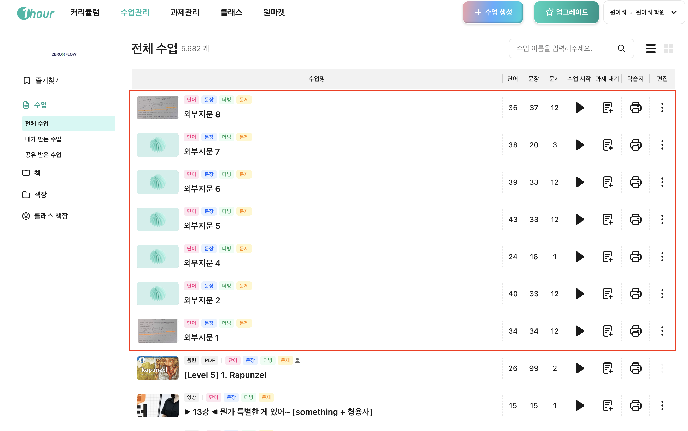
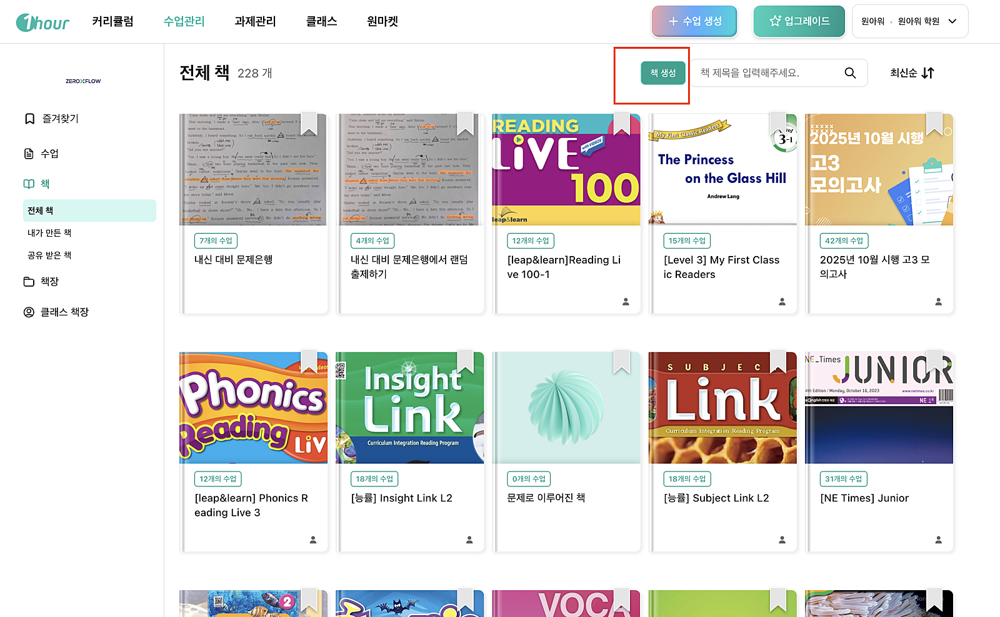
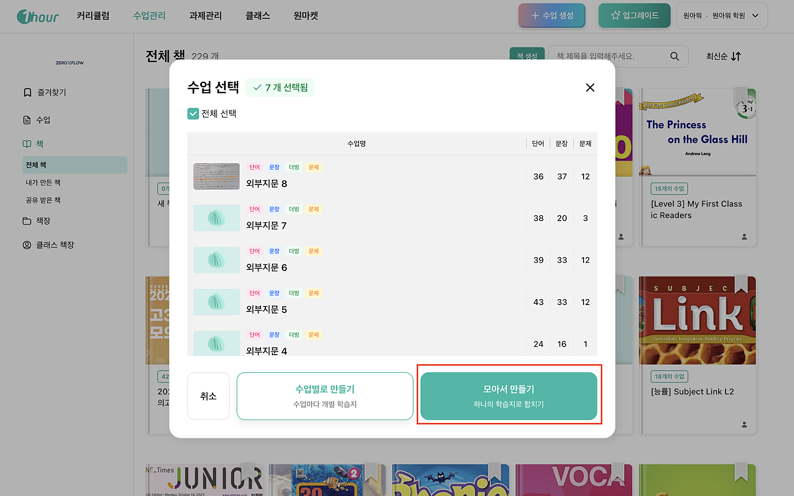
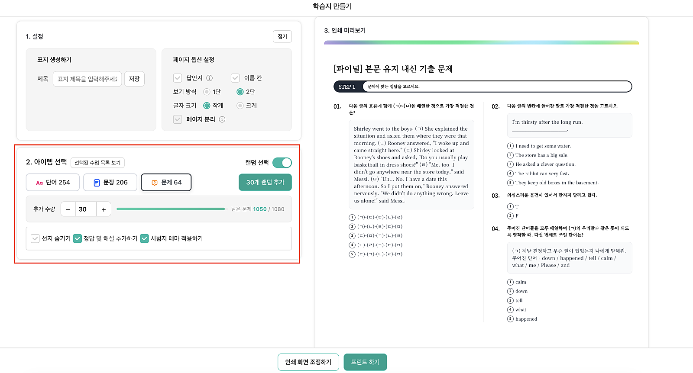

# v. 변형문제 생성 → 파이널 시험지 랜덤 인쇄

#### **I. 이런 분들에게 추천해요**

* 내신 시즌마다 변형문제 시험지를 여러 세트 만들어야 하는 학원 원장님
* 학생마다 다른 구성의 모의고사를 제공하고 싶은 선생님
*   1,000문제가 넘는 문제 풀에서 효율적으로 시험지를 뽑고 싶은 분

    ​

#### **II. 영상 보며 따라하기**



#### **III. 이미지 보며 따라하기**

1.  **외부 지문별 변형문제 세트 준비하기**

    \
    먼저 원아워에서 외부 지문별로 변형문제 세트를 만들어 둡니다. 예를 들어 지문 1번부터 8번까지, 각 세트당 약 20문제씩 구성하면 총 160문제 이상의 문제 풀이 확보됩니다. 지문 수와 문제 수를 늘릴수록 문제은행의 규모는 더 커지겠죠.

<figure><figcaption></figcaption></figure>

2.  **"책 생성"으로 문제은행 만들기**

    원아워의 **책** 메뉴로 이동한 뒤 **책 생성** 버튼을 클릭합니다. 이름은 자유롭게 설정하면 되는데, 예를 들어 "내신 대비 문제집 문제은행"처럼 알아보기 쉽게 지정하면 관리가 편합니다. 그다음, 앞서 만들어 둔 문제 세트들을 선택해서 추가합니다. 여러 세트를 한꺼번에 선택할 수 있으니 필요한 만큼 체크한 후 저장하면 됩니다.

<figure><figcaption></figcaption></figure>

3. **학습지 메뉴에서 "모아서 만들기"**\
   \
   책이 만들어졌으면 **학습지** 버튼을 클릭합니다. 여기서 핵심 기능이 등장하는데요, 여러 수업(문제 세트)을 **하나의 학습지로 합칠** **수** 있습니다. "모아서 만들기"를 선택하면, 예를 들어 1,080문제가 하나의 문제 풀로 통합됩니다.

<figure><figcaption></figcaption></figure>

 

4. **랜덤으로 시험지 출제하기**\
   \
   이제 가장 기대되는 순간입니다. 문제를 추가할 때 **"랜덤 섞기 선택"** 버튼을 눌러 보세요. 1,080문제 중에서 원하는 수량만큼 랜덤으로 뽑을 수 있습니다.\
   \
   30문제를 뽑으면 여러 지문에서 골고루 섞인 시험지가 만들어지고, 20문제를 추가하면 또 다른 구성의 시험지가 생깁니다. 50문제짜리 대형 모의고사도 클릭 한 번이면 완성이죠. 정답과 해설까지 자동으로 포함되니 별도로 답안지를 만들 필요도 없습니다.

<figure><figcaption></figcaption></figure>

#### **왜 이 기능이 특별한가?**

실제 학교 시험처럼 여러 지문이 섞여 출제되기 때문에 학생 입장에서도 실전 감각을 기르기에 안성맞춤입니다. 무엇보다, 같은 문제은행에서 매번 다른 조합의 시험지를 무한히 생성할 수 있다는 것이 가장 큰 장점입니다. 학생 A와 학생 B가 서로 다른 시험지를 풀 수 있고, 반복 학습 시에도 매번 새로운 구성으로 연습할 수 있습니다.

#### 한눈에 보는 요약

전체 과정을 정리하면 이렇습니다. 먼저 **책** 메뉴에서 문제은행용 책을 생성하고, 변형문제 세트들을 추가합니다. 그다음 **학습지**에서 "모아서 만들기"로 전체 문제를 하나로 합친 뒤, **랜덤 섞기**로 원하는 수량만큼 문제를 뽑습니다. 마지막으로 정답 및 해설을 추가하고 시험지 테마를 적용하면 끝입니다.

이번 내신 시즌, 문제은행 기능을 활용해서 학생들에게 양질의 변형문제 시험지를 제공해 보세요. 준비 시간은 줄이고, 학습 효과는 높이는 스마트한 내신 대비가 될 겁니다.

 

