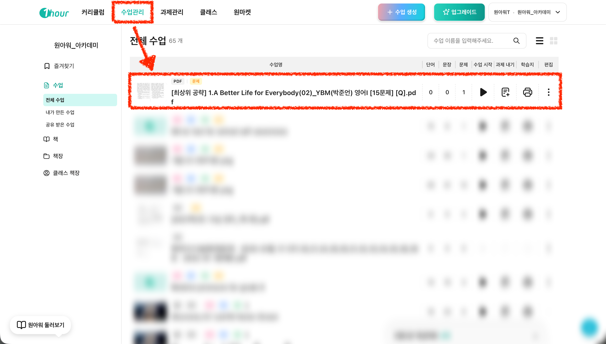

# iii. 기출문제 바탕 → 킬러 문항 대비

#### I. 이런 분들에게 추천해요

* 기출문제와 비슷한 유형의 문제를 추가로 만들고 싶은 분
* 학교별 시험 스타일에 맞춘 심화 자료를 준비하고 싶은 분
* 내신 킬러 문항이나 변별력 있는 문제로 학생 실력을 점검하고 싶은 분

#### II. **영상 보며 따라하기**



####

#### III. 이미지 보며 따라하기

1. **우상단 "+ 수업 생성" 버튼 클릭 후 "기출 쌍둥이 변형 문제" 선택해 주세요.**

<figure><figcaption></figcaption></figure>

2. **갖고 계신 PDF 파일(=지난 시험의 기출문제)을 업로드 합니다.**

<figure><figcaption></figcaption></figure>

3. **지문(=이번 시험에 나올 지문)을 기입해 주세요.**

<figure><figcaption></figcaption></figure>

4. **원하는 쌍둥이 문제의 난이도를 선택해 주세요.**

* 중등 문제를 넣으셔도 생성이 가능하기는 해요. 다만, 현재는 고등 위주여서 지문의 난이도가 조금 더 높아진다고 생각해주시면 됩니다.
* 한 번 만들어서 결과를 보시고 학원에서 사용하실 수 있는 난이도인지 체크해 보시길 추천드려요!

<figure><figcaption></figcaption></figure>

5. **"작업목록" 진행 중 상태가 완료되면 문제 생성이 끝나요.**

* 굳이 '문제 생성 시간'을 기다리지 않아도 됩니다. 동시에 다른 문제를 바로 생성하실 수 있어요!

<figure><figcaption></figcaption></figure>

6. **문제 생성이 완료되었다면 "수업관리"에서 확인하실 수 있어요.**
   * 이후 아래 2가지 용도에 따라 활용하실 수 있습니다.
     * \[과제 내기] 온라인 학습용, 학생에게 과제 부여 [\*자세한 가이드는 해당 페이지를 확인해 주세요!](https://1hour.gitbook.io/guide/teacher/assignment-management)
     * \[학습지 만들기] 오프라인 수업용, 프린트 학습지를 만드는 용도

<figure><figcaption></figcaption></figure>
