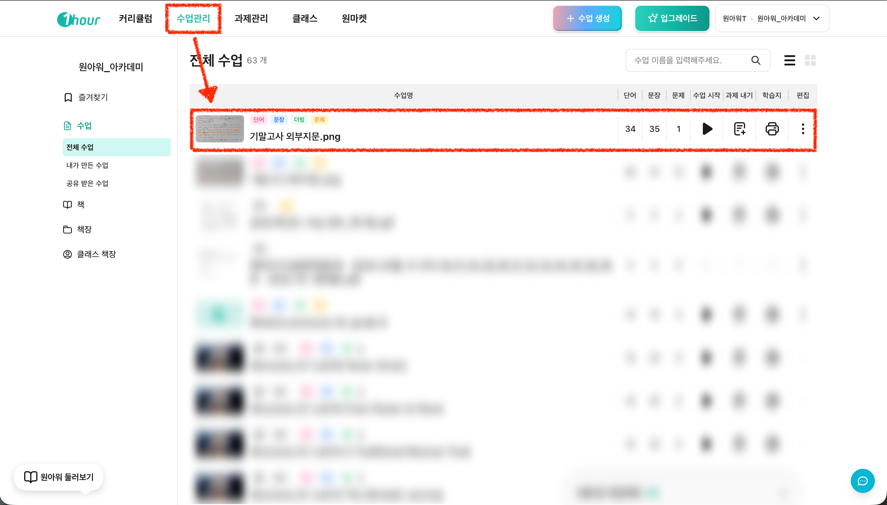

# 1. 이미지 업로드 → 변형문제 생성

#### I. 이런 선생님께 추천해요!

* JPG, JPEG, PNG 파일을 갖고 계신 분
* 사진 이미지로 보관 중인 학교 기출, 프린트물을 활용하실 분
* 외부 지문을 바탕으로 "내용 이해, 단어, 문법" 등 다양한 형태 변형문제로 만들고 싶은 분

#### II. 영상을 보며 따라하기

#### III. 이미지를 보며 따라하기

1. **우상단 "+ 수업 생성" 버튼 클릭 후 "외부지문 변형 문제" 선택해 주세요.**

<figure><figcaption></figcaption></figure>

2. **갖고 계신 사진파일을 업로드 합니다.**

* 파일 확장자 JPG, JPEG, PNG만 가능합니다. PDF 파일을 갖고 계시다면 "3.기출문제 바탕 → 킬러 문항 대비" 가이드로 이동해 주세요.

<figure><figcaption></figcaption></figure>

3. **최대 10장까지 추가 가능하오니, 본문이 긴 경우에도 얼마든지 생성이 가능해요!**

<figure><figcaption></figcaption></figure>

4. **원하는 변형 문제 유형을 선택해 주세요.**

<figure><figcaption></figcaption></figure>

5. **"작업목록" 진행 중 상태가 완료되면 문제 생성이 끝나요.**

* 굳이 '문제 생성 시간'을 기다리지 않아도 됩니다. 동시에 다른 문제를 바로 생성하실 수 있어요!

<figure><figcaption></figcaption></figure>

6. **문제 생성이 완료되었다면 "수업관리"에서 확인하실 수 있습니다.**

* 이후 아래 2가지 용도에 따라 활용하실 수 있습니다!
  * 과제 내기: 온라인 학습용, 학생에게 과제 부여 [\*자세한 가이드는 해당 페이지를 확인해 주세요!](https://1hour.gitbook.io/guide/teacher/assignment-management)
  * 학습지 만들기: 오프라인 수업용, 프린트 학습지를 만드는 용도

<figure><figcaption></figcaption></figure>

_\*곧 업데이트 완료할 예정입니다._

